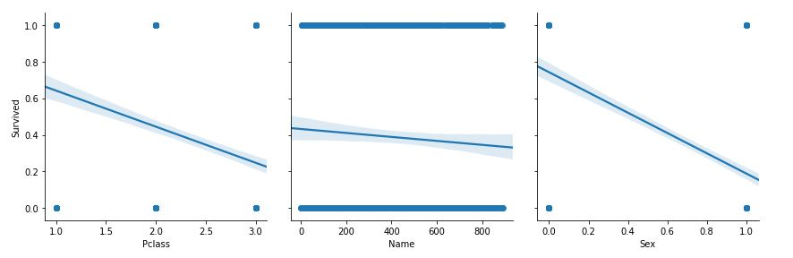
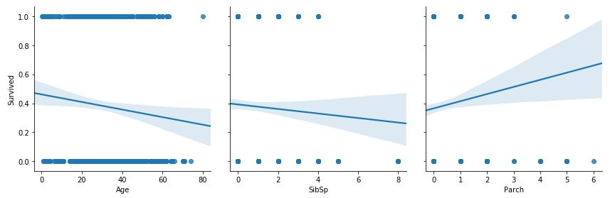
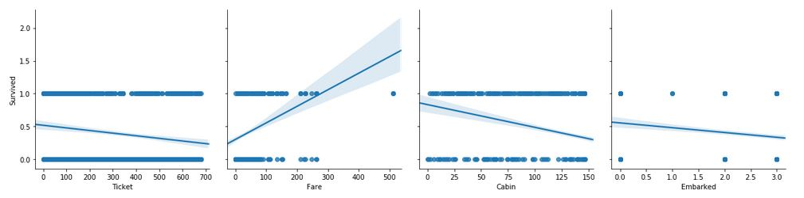

# Titanic-dataset
A cleaned and processed version of the Titanic disaster dataset

The famous dataset had been cleaned and processed to deal with the issues of this dataset such as empty entries, nun-numerical values,..etc.

### The following figures show the relationship between the different features and survival from which we can deduce which features to use and which not to.

### From the figures above, we can deduce higher survival rates for passengers who have the following attributes:

  * Lower Pclass value (upper-calss passengers i.e. 1st class and 2nd class passengers)
  * Are females
  * Of age less than 20
  * With relatives of the first degree or have no relatives at all
  * Have high number of parents/children
  * Have tickets encoded between 0 and 50
  * Paid higher fares
  * Have cabins with smaller numbers (i.e. those of the upper levels A,B,C..etc,), which matches lower PClass
  * Have embarked from Cherbourg (Ports are: C = Cherbourg; Q = Queenstown; S = Southampton)
### While the name almost has no effect on the chance of survival.

### This data is ready to be used to train a machine learning model.
